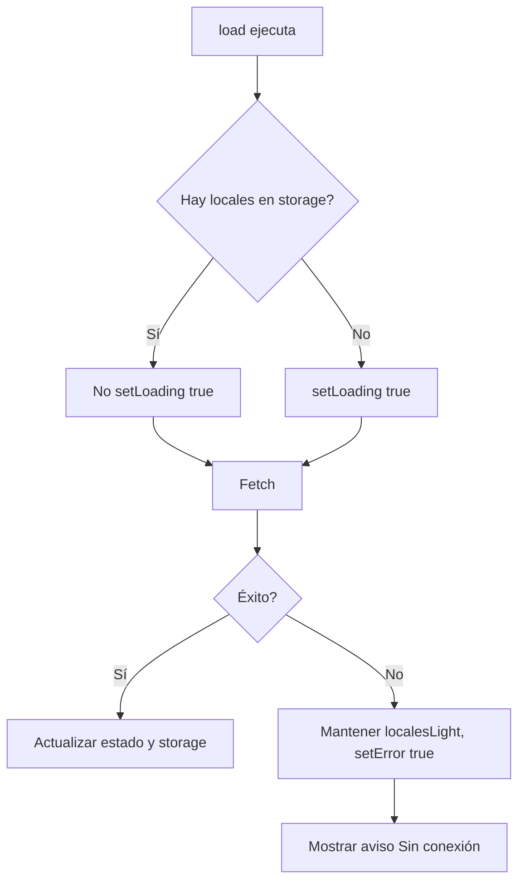

# Plan: Auditoría seguridad y UX robusta

## 1. Errores silenciosos (background refresh)

**Problema:** Si el fetch en segundo plano falla, hoy `load()` pone `error=true` pero no actualiza `localesLight` ni borra el storage (correcto). Lo que falta es que **el usuario no ve feedback**: `AndinaContext.error` no se usa en ningún componente.

**Archivo:** [lib/AndinaContext.tsx](lib/AndinaContext.tsx)

- Al fallar, no cambiar `localesLight` (ya está bien).
- No tocar `sessionStorage` en el `catch` (ya está bien).
- No poner `setLoading(true)` al inicio de `load()` cuando ya hay datos en storage, para evitar flash de skeleton. Si `localesLight.length > 0`, no llamar a `setLoading(true)` al entrar en `load()`.

**Archivo:** [app/page.tsx](app/page.tsx)

- Consumir `error` de `useAndinaConfig()`.
- Cuando `error && localesList.length > 0`: mostrar un aviso discreto tipo “Sin conexión – Mostrando datos guardados” con un botón “Reintentar” que llame a `refreshConfig()`. Colocarlo encima o debajo de “Locales cerca de ti”.

---

## 2. Consistencia Abierto/Cerrado (transición suave)

**Problema:** Si el local pasa de “Abierto” a “Cerrado” tras el refresh, el overlay y el `opacity-60` cambian de golpe.

**Archivo:** [app/page.tsx](app/page.tsx)

- Añadir `transition-opacity duration-300` al overlay `bg-gray-900/40` y al badge “Cerrado”.
- Añadir `transition-opacity duration-300` al `opacity-60` del `LocalLogo` y al `UtensilsCrossed` cuando `cerrado`.

Ejemplo:

```tsx
<div className="absolute inset-0 bg-gray-900/40 z-[1] transition-opacity duration-300" ... />
```

y mantener `transition-opacity` en las clases que usan `opacity-60` y `opacity-90`.

---

## 3. Fallback de imágenes en banners

**Problema:** Los banners en [app/page.tsx](app/page.tsx) usan `next/image` sin `onError`. Si una imagen falla, se ve el ícono de imagen rota.

**Archivo:** [app/page.tsx](app/page.tsx)

- Crear un componente `BannerImage` o usar un patrón inline: estado `imageError` por banner, `onError` en `Image` que activa el fallback.
- Fallback: `div` con `bg-gray-200` y un ícono tipo `Store` o `ImageOff` de lucide-react (similar a `LocalLogo`).
- Alternativa: extraer un componente reutilizable `SafeBannerImage` con `onError` y placeholder.

---

## 4. Limpieza de consola

**Archivos cliente / código que toca al usuario:**


| Archivo                                                                            | Líneas     | Acción                                                                                                                      |
| ---------------------------------------------------------------------------------- | ---------- | --------------------------------------------------------------------------------------------------------------------------- |
| [components/NotificationPromptBanner.tsx](components/NotificationPromptBanner.tsx) | 67, 71, 74 | Quitar `console.log` de debug; dejar solo `console.warn` en fallo de token si aporta para debugging (o eliminarlo en prod). |
| [app/perfil/page.tsx](app/perfil/page.tsx)                                         | 194, 219   | Sustituir `console.error` por `toast.error` o manejo de error visible para el usuario.                                      |


**Archivos servidor / scripts:** Mantener `console.error` en APIs para logs; reducir `console.log` de éxito en `app/api/fcm/register`, `app/api/fcm/unregister`, `lib/fcm-send-server.ts` si se quiere producción limpia. Scripts (seed, migrate, backup) pueden conservar `console` para salida CLI.

**Criterio:** Limpiar en componentes cliente y en rutas de API usadas en producción. Los que tocamos en esta sesión (AndinaContext, page.tsx, LocalLogo) ya están sin `console.log` innecesarios.

---

## 5. Otras áreas a revisar

Tras el análisis del codebase:

- **InfoLocal / restaurante/[id]:** Verificar que las imágenes de logo/cover usen el mismo fallback que `LocalLogo` (onError + ícono) para no mostrar imágenes rotas.
- **NetworkBanner vs AndinaContext.error:** Son distintos: `NetworkBanner` = offline; `AndinaContext.error` = fallo al cargar config/locales. Mantener ambos y diferenciar mensajes.
- **RefreshConfig en paneles:** Paneles maestro/central llaman a `refreshConfig()` tras cambios; está bien. Asegurarse de no llamar `setLoading(true)` al inicio de `load()` cuando ya hay datos en storage, para evitar parpadeos.
- **SkeletonLocales:** Si el skeleton y el grid comparten layout similar, la transición ya se beneficia del `animate-fade-in`. No requiere cambios adicionales urgentes.
- **Empty state:** El estado vacío de “No hay resultados” está definido y es claro.

---

## Prompt de ejecución (agente)

Usar este bloque como instrucción al implementar el plan:

> Agent, vamos a ejecutar el Plan de Auditoría de Seguridad y UX Robusta. Sigue estos pasos con precisión:
>
> 1. **AndinaContext (Resiliencia):**
>   - Modifica `load()` para que NO llame a `setLoading(true)` si ya existen locales en `localesLight`.
>   - Asegúrate de que un error en el fetch active `setError(true)` pero mantenga los datos previos.
> 2. **Home UX (Feedback y suavizado):**
>   - Implementa el aviso discreto de "Sin conexión" con botón de reintento.
>   - Añade las clases `transition-opacity duration-300` a los overlays de "Cerrado" y a los badges para que los cambios de estado sean suaves.
> 3. **Banners (Seguridad visual):**
>   - Crea el componente `SafeBannerImage` o implementa el `onError` con fallback elegante para evitar imágenes rotas en el carrusel.
> 4. **Limpieza (Clean Code):**
>   - Purga los `console.log` de `NotificationPromptBanner.tsx` y cambia los `console.error` de `app/perfil/page.tsx` por un feedback visual (toast o mensaje).
>
> Al terminar, verifica que el build pase limpio.

---

## Resumen de archivos a modificar


| Archivo                                                                            | Cambios                                                                                                                                                                                    |
| ---------------------------------------------------------------------------------- | ------------------------------------------------------------------------------------------------------------------------------------------------------------------------------------------ |
| [lib/AndinaContext.tsx](lib/AndinaContext.tsx)                                     | No hacer `setLoading(true)` si ya hay locales en storage al entrar en `load()`.                                                                                                            |
| [app/page.tsx](app/page.tsx)                                                       | Consumir `error` de `useAndinaConfig`, aviso “Sin conexión – Mostrando datos guardados” + Reintentar; `transition-opacity` en overlay/badge Cerrado y logo; fallback de imagen en banners. |
| [components/NotificationPromptBanner.tsx](components/NotificationPromptBanner.tsx) | Eliminar `console.log` de debug.                                                                                                                                                           |
| [app/perfil/page.tsx](app/perfil/page.tsx)                                         | Reemplazar `console.error` por feedback al usuario (ej. toast) donde aplique.                                                                                                              |


---

## Flujo de error (resumen)




