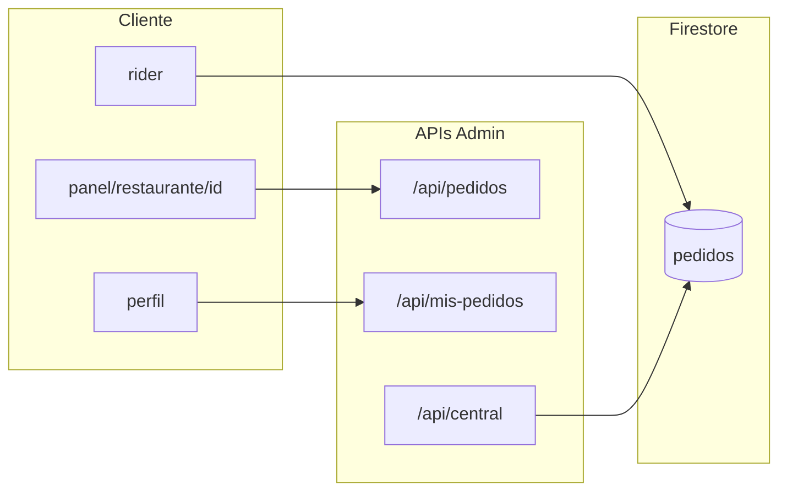

# Plan: saneamiento de costos Firestore (Bugatti Mode — Nivel Inmortal 10/10)

## Hallazgos del código actual (relevantes)

- **Persistencia:** [`lib/firebase/client.ts`](lib/firebase/client.ts) usa solo `getFirestore()`; hay singleton `_db`, pero **no hay** `persistentLocalCache` / `persistentMultipleTabManager`.
- **Listas de pedidos en las páginas citadas:**
  - [`app/panel/restaurante/[id]/page.tsx`](app/panel/restaurante/[id]/page.tsx) hace **fetch a `/api/pedidos`** (`soloActivos=true`) y **polling cada 45s**; los límites son **del servidor** en [`app/api/pedidos/route.ts`](app/api/pedidos/route.ts) (`LIMIT_POLL = 50`, `limit=4` para entregados con cursor).
  - [`app/perfil/page.tsx`](app/perfil/page.tsx) carga historial vía **GET `/api/mis-pedidos`**. El servidor hace **`limit(50)`** en [`app/api/mis-pedidos/route.ts`](app/api/mis-pedidos/route.ts).
  - [`app/panel/maestro/page.tsx`](app/panel/maestro/page.tsx) **no** lista pedidos; el maestro usa el mismo panel de restaurante cuando abre un local.
- **Único `onSnapshot` en la app:** [`app/panel/rider/page.tsx`](app/panel/rider/page.tsx) — ya con `limit(50)` / `limit(20)` y `unsubscribe` en cleanup.
- **`lib/useNotifications.ts`:** solo FCM y `fetch`; **no** afecta lecturas de Firestore.

---

## 1. Persistencia offline (crítico) — [`lib/firebase/client.ts`](lib/firebase/client.ts)

**Objetivo:** Reemplazar `getFirestore` por **`initializeFirestore`** con:

- **Cliente** (`typeof window !== 'undefined'`): `localCache: persistentLocalCache({ tabManager: persistentMultipleTabManager() })`.
- **Servidor (SSR Next.js / Vercel):** **`memoryLocalCache()`** — forma explícita de “solo RAM, nada en disco”. Evita:
  - errores de TypeScript que a veces exigen `localCache` en `initializeFirestore`;
  - fallos en tiempo de ejecución tipo **“IndexedDB is not defined”** en entornos server/edge.

No usar `initializeFirestore(app, {})` como comodín si los tipos o el runtime obligan a declarar caché: **`memoryLocalCache()`** es la rama limpia para SSR.

**Integración:**

- Mantener singleton `_db` y `getFirebaseApp()` compartido con Auth/Storage.
- Una sola llamada a `initializeFirestore` por proceso (módulo cachea `_db`).
- Log de depuración solo en desarrollo o omitir.

**Expectativa de coste:** persistencia en **cliente** acelera relecturas desde caché local; las rutas **Admin** en API **no** usan este caché.

---

## 2. Blindaje de consultas y “Cargar más” (estrategia Bugatti)

**Regla de negocio (evitar pantalla incompleta):**

| Tipo | Política de límite | Motivo |
|------|-------------------|--------|
| **Historial (entregados / lista larga de pasado)** | **`limit` ~15** sin miedo + **cursor** + “Cargar más” | Nadie necesita 50 pedidos viejos de golpe; aquí está el ahorro fuerte. |
| **Activos** (`soloActivos=true`: preparando, rider, etc.) | **Mantener límite alto (p. ej. 50)** | Un local con mucha demanda puede tener 25+ pedidos en cocina; **recortar activos ocultaría órdenes** y rompería operación. |

**Implementación concreta:**

- [`app/api/pedidos/route.ts`](app/api/pedidos/route.ts): separar constantes — una para **poll de activos** (p. ej. seguir en **50**) y otra para **entregados** (p. ej. **15** con `startAfter` ya existente). Revisar **fallbacks** que hoy hacen `limit(100)` para que no desmonten el ahorro en historial sin romper índices.
- [`app/api/mis-pedidos/route.ts`](app/api/mis-pedidos/route.ts): **`limit(15–20)`** + `nextCursor` + `startAfter` (historial del **cliente**; no es el panel de cocina).
- [`app/perfil/page.tsx`](app/perfil/page.tsx): botón **“Cargar más”** pasando `cursor`.
- [`app/panel/restaurante/[id]/page.tsx`](app/panel/restaurante/[id]/page.tsx): **no** bajar el límite de activos; solo ajustes de UX en **entregados** / historial del panel si aplica.

[`app/panel/maestro/page.tsx`](app/panel/maestro/page.tsx): sin consulta directa de pedidos; mismo comportamiento vía API del local.

**Otra fuente:** [`app/api/central/route.ts`](app/api/central/route.ts) (50 pedidos por rango) — alinear en una iteración posterior si hace falta.

---

## 3. Denormalización en POST — “seguro de vida” — [`app/api/pedidos/route.ts`](app/api/pedidos/route.ts) (POST)

**Estado:** POST ya escribe datos de restaurante y hace **`locales/{localId}.get()`** para coords.

**Campos a volcar en el pedido (snapshot en el momento de la compra):**

- **`localId`** — ya se guarda; mantenerlo como fuente de verdad del vínculo.
- **`nombreLocal`** / alinear con `restaurante` si ya refleja el nombre comercial.
- **`logoLocal`**, **`fotoLocal`** (o cover si aplica) — URLs tal como estaban **en ese instante**.
- **`telefonoLocal`** — útil para soporte/display sin releer `locales`.

**Por qué:** si mañana el local cambia nombre, logo o teléfono, los **pedidos viejos** siguen mostrando la **foto del momento** (contabilidad / experiencia de historial).

**Consumo UI:** [`app/perfil/page.tsx`](app/perfil/page.tsx) hoy usa `logoRestaurante: /logos/${localId}.png` — pasar a **preferir** campos denormalizados del pedido con fallback legacy.

**Componente:** [`components/usuario/TarjetaPedidoHistorial.tsx`](components/usuario/TarjetaPedidoHistorial.tsx) — tipo `PedidoHistorial` ampliado.

**Tipos:** [`lib/types`](lib/types) (`PedidoCentral`) — campos opcionales.

---

## 4. Contadores `stats` por local (propuesta)

Igual que antes: documento agregado, `FieldValue.increment`, idempotencia en reintentos.

---

## 5. Auditoría re-renders y listeners

Igual que antes: solo rider con `onSnapshot` + cleanup; polling restaurante; `useNotifications` opcional.

---

## Impacto estimado sobre lecturas (modelo mental 22k/día)

Ejemplo **cliente / historial vía SDK con persistencia** (no aplica 1:1 a Admin API, pero ilustra el efecto de caché):

| | Antes | Después (persistencia + límite historial) |
|---|--------|---------------------------------------------|
| Entrada | p. ej. 50 docs → 50 lecturas | p. ej. 15 docs → 15 lecturas |
| Refresco de página | otras 50 desde red | **0 lecturas desde red** si los mismos datos siguen en IndexedDB (servidas desde caché local) |

**Ahorro orientativo:** fuerte reducción en escenarios con **repetición de mismas lecturas** en el cliente; las APIs Admin siguen midiendo por request — combinar con **límites de historial** y **menos polling** para el total del proyecto.

---

## Orden de implementación sugerido

1. [`lib/firebase/client.ts`](lib/firebase/client.ts) — cliente: `persistentLocalCache` + multi-tab; SSR: **`memoryLocalCache()`**.
2. **APIs** — política dual activos (50) vs historial (15) + cursores en `mis-pedidos` y entregados; perfil “Cargar más”.
3. **POST pedidos** — denormalización + tipos + UI.
4. **Stats** — segunda fase si aplica.

**Riesgo mitigado:** no se reduce el límite de **pedidos activos** del restaurante; solo se agresiva el **historial** donde el negocio lo tolera.
