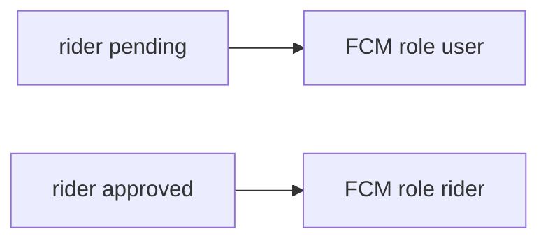

# Plan de Pulido Operativo Final — Andina Delivery

Objetivo: persistencia de permisos, restricción del flujo de riders pendientes y controles FCM alineados con la validación por dispositivo actual (`hasCurrentToken`).

---

## 1. Persistencia del Wizard (`localStorage`)

**Archivo:** [`components/PostLoginPermissionsWizard.tsx`](components/PostLoginPermissionsWizard.tsx)

- Sustituir `sessionStorage` por **`localStorage`** para el estado del wizard.
- **Clave por usuario:** `andina_perm_wizard_v1_${user.uid}` (JSON recomendado: flags por notif/geo según lo ya implementado en el componente).
- **Regla de negocio:** no marcar el paso de **notificaciones** como completado salvo que `Notification.permission === 'granted'`. Si el usuario cierra el navegador sin conceder, al volver el wizard debe **reaparecer**.
- Mantener coherencia con el evento `andina-perm-wizard-done` y los consumidores ([`NotificationPromptBanner.tsx`](components/NotificationPromptBanner.tsx), [`LocationBackupBanner.tsx`](components/LocationBackupBanner.tsx)): actualizar listeners para cambios persistidos (p. ej. disparar sync tras escribir `localStorage` o reutilizar el mismo evento).

---

## 2. Bloqueo de Rider Pendiente

**Nuevo hook:** [`lib/usePendingRiderClientBlock.ts`](lib/usePendingRiderClientBlock.ts) (o `hooks/` según convención del repo)

- Condición: `user?.rol === 'rider'` y `user.riderStatus !== 'approved'` (tratar `undefined` como pendiente alineado con [`lib/useAuth.ts`](lib/useAuth.ts)).
- En rutas **Home** [`app/page.tsx`](app/page.tsx), **Carrito** [`app/carrito/page.tsx`](app/carrito/page.tsx), **Checkout** [`app/checkout/page.tsx`](app/checkout/page.tsx): `router.replace('/panel/rider')` cuando la condición se cumpla (tras `authLoading` false).

**Panel rider** [`app/panel/rider/page.tsx`](app/panel/rider/page.tsx)

- Para estados no aprobados (`pending`, `rejected`, `suspended`): **eliminar** el botón «Volver al inicio».
- Mostrar solo mensaje contextual + **Cerrar sesión** (reutilizar [`ModalCerrarSesion`](components/panel/ModalCerrarSesion.tsx) o el patrón ya usado en el panel).

**Complemento acordado antes:** en [`app/auth/page.tsx`](app/auth/page.tsx) pantalla `registro-exitoso-rider`, quitar acciones que lleven a modo cliente o confundan; dejar flujo alineado con «solo espera / login» (sin «Volver al inicio»).

---

## 3. Roles FCM Dinámicos

**Nuevo helper:** `effectiveNotificationRole(user: AndinaUser | null): NotificationRole` — por ejemplo en [`lib/fcmEffectiveRole.ts`](lib/fcmEffectiveRole.ts).

- Si `user.rol === 'rider'` y **no** está `approved` → devolver **`'user'`** para registro FCM y sondas.
- Si rider **aprobado** → **`'rider'`** (comportamiento actual).
- Resto de roles: sin cambio (maestro → central, etc.).

**Aplicar en:**

- [`lib/useNotifications.ts`](lib/useNotifications.ts) — sustituir / combinar con `fcmRoleFromProfile` donde corresponda.
- [`components/FCMAutoRegister.tsx`](components/FCMAutoRegister.tsx) — rol en `register` y `/api/fcm/status`.
- [`components/NotificationShield.tsx`](components/NotificationShield.tsx) — **no** mostrar el escudo operativo estricto a riders pendientes (deben seguir el flujo tipo cliente + FCM `user`); solo riders aprobados (y demás operativos) con el escudo actual.

**API:** [`POST /api/fcm/register`](app/api/fcm/register/route.ts) ya admite `role: user` sin exigir `auth.rol === cliente'`; validar en prueba que no haya regresión.

---

## 4. Controles Manuales en Perfil

- [`app/perfil/page.tsx`](app/perfil/page.tsx): sección **«Notificaciones de este dispositivo»** con:
  - **Desactivar notificaciones:** llamar flujo existente de unregister + opt-out ([`useNotifications`](lib/useNotifications.ts) `desactivar` o equivalente).
  - **Sincronizar ahora:** `resincronizarNotificaciones` o `reintentarRegistro` + `forceRefresh` según lo ya expuesto por el hook.
- **Formulario de ajustes del local:** [`components/panel/ProfileSettingsForm.tsx`](components/panel/ProfileSettingsForm.tsx) (y/o perfil local en [`app/panel/restaurante/[id]/perfil/page.tsx`](app/panel/restaurante/[id]/perfil/page.tsx)) — misma sección para rol `local`.

Textos claros y estados de carga/error consistentes con el resto de la app.

---

## 5. Limpieza al Logout

[`lib/useAuth.ts`](lib/useAuth.ts)

- Además de [`clearAllFcmLocalStorageKeys`](lib/fcmLogout.ts) y claves `andina_fcm_token_*`, **eliminar** las claves del wizard: `localStorage` cuyo prefijo sea `andina_perm_wizard_v1_` (o la clave exacta `andina_perm_wizard_v1_${uid}` del usuario actual antes de `signOut`).

Así el siguiente usuario en el mismo navegador no hereda el estado del wizard.

---

## Coherencia técnica

- No debilitar la regla de **`serverTokenRegistered`** basada en `hasCurrentToken` y `Notification.permission === 'granted'` ([`lib/useNotifications.ts`](lib/useNotifications.ts)).
- Tras cambios, ejecutar **`npm run build`** y corregir tipos/lint.

---

## Diagrama (rol FCM rider)

