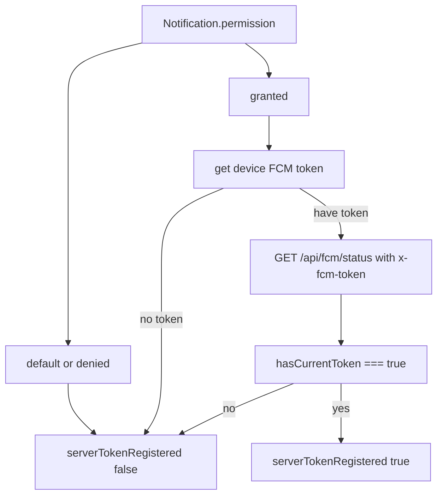

# Reforma total del sistema de notificaciones (FCM)

Objetivo: eliminar **falsos positivos** y asegurar que **todo personal operativo** tenga alertas activas de forma obligatoria, con sincronización real **por dispositivo**.

---

## 1. Sincronización real por dispositivo — [`lib/useNotifications.ts`](lib/useNotifications.ts)

**Regla de oro:** `serverTokenRegistered` solo puede ser `true` si:

- `Notification.permission === 'granted'`, **y**
- la API confirma que el token de **este dispositivo** está en el servidor: `hasCurrentToken === true`.

**Modificación de `refreshServerTokenStatus`:**

- Eliminar el fallback que marcaba registrado cuando el servidor tenía cualquier token (`data.hasToken` sin comprobar el dispositivo actual).

**Sonda proactiva:**

- Si no hay token en `localStorage` pero el permiso está concedido, intentar obtener el token actual con `getFCMToken()` (desde [`lib/fcm-client.ts`](lib/fcm-client.ts)) y enviarlo en el header `x-fcm-token` a `GET /api/fcm/status` para verificar si **este dispositivo** ya está registrado.

**Prevención de bucles infinitos:**

- Al añadir la sonda y nuevas dependencias en `useEffect`, asegurar:
  - refs o flags para no re-disparar la misma secuencia en cadena (p. ej. `refreshServerTokenStatus` estable con `useCallback` y dependencias mínimas correctas).
  - no poner en dependencias valores que cambien en cada render por objetos nuevos.
  - separar efectos: uno para leer `Notification.permission`, otro para sync con servidor si aplica.
- Tras cambios, **verificar que el build pase** (`next build` o script del proyecto) y probar manualmente que no hay re-renders infinitos en consola React.

---

## 2. El Guardián operativo — [`components/NotificationShield.tsx`](components/NotificationShield.tsx)

**Bloqueo estricto:** Si el rol es operativo (`local`, `rider`, `central`, `maestro`) y el permiso es `default` **o** `denied`, `NotificationShield` debe ser una **pantalla completa bloqueante** (sin acceso al panel detrás).

**Eliminación de escapes:**

- Quitar botones **Omitir**, **Saltar**, **Continuar sin notificaciones** para roles operativos.
- No usar `sessionStorage` (ni claves equivalentes) para ocultar el escudo si no hay permiso concedido.

**Mensaje de negocio:** Texto explícito del estilo:

- *«Activación necesaria: sin notificaciones no podrás recibir órdenes»* (ajustar variante según rol si hace falta).

**Quitar** el `useEffect` que dispara automáticamente `requestPermission()` al montar (el prompt del navegador solo tras el flujo en dos pasos).

**Eliminar** lógica que dejaba pasar la primera visita con `backupOk` / `isBackupLaunchEligible` cuando el permiso sigue en `default` en contexto operativo.

---

## 3. Flujo de activación en dos pasos (UX)

En el Shield, transición de estados explícita:

| Paso | Nombre | Contenido |
|------|--------|-----------|
| **A (Intro)** | Explicación | Por qué es vital activar las alertas; botón **«Siguiente»** (no llama a `requestPermission`). |
| **B (Preparación)** | Aviso navegador | Indicar que el navegador mostrará un diálogo; botón **«Permitir notificaciones»** que llama a `requestPermission()` del hook. |

`requestPermission` en [`lib/useNotifications.ts`](lib/useNotifications.ts) puede mantener su implementación interna (permiso + SW + token + registro); solo cambia **cuándo** se invoca desde el Shield.

---

## 4. Gestión de permiso denegado (`denied`)

- Si el estado es `denied`, mostrar una **pantalla de ayuda** distinta, orientada por plataforma:
  - Usar [`isIOS()`](lib/fcm-client.ts) (o equivalente) para **Safari / iOS PWA** vs **Chrome / Android / escritorio**.
- Incluir instrucciones claras para abrir ajustes del navegador y desbloquear el sitio.
- **No permitir acceso al panel** hasta que el permiso pase a `granted` (pantalla bloqueante continua; reintentar al volver al foco con `visibilitychange` opcional para releer `Notification.permission`).

---

## 5. Limpieza total en logout — [`lib/useAuth.ts`](lib/useAuth.ts)

- **Antes** de `signOut`, intentar obtener el token del **dispositivo actual** (si `Notification.permission === 'granted'`, vía `getFCMToken()` o lectura de `localStorage` primero) y llamar a `POST /api/fcm/unregister` con `{ role, token }` según [`app/api/fcm/unregister/route.ts`](app/api/fcm/unregister/route.ts).
- Tras cerrar sesión, **limpiar todas las claves** `andina_fcm_token_*` (y pendientes `andina_fcm_pending_*` si aplica) en `localStorage`, no solo la del rol actual si quedan residuos multi-rol en el mismo origen.

Opcional: extraer helper `unregisterCurrentDeviceFromFcm()` en [`lib/fcm-client.ts`](lib/fcm-client.ts) o módulo pequeño dedicado para no inflar `useAuth`.

---

## 6. Consistencia en banners

Alinear [`components/NotificationPromptBanner.tsx`](components/NotificationPromptBanner.tsx) y [`components/FCMAutoRegister.tsx`](components/FCMAutoRegister.tsx) con la lógica de **dispositivo actual**:

- No basar mensajes de “ya registrado” solo en `hasToken` del servidor sin `x-fcm-token`.
- Evitar textos contradictorios con el nuevo `serverTokenRegistered` del hook.

Revisar consumidores: [`app/perfil/page.tsx`](app/perfil/page.tsx), [`app/panel/restaurante/[id]/perfil/page.tsx`](app/panel/restaurante/[id]/perfil/page.tsx), [`components/panel/ProfileSettingsForm.tsx`](components/panel/ProfileSettingsForm.tsx).

---

## Verificación final

- Ejecutar build del proyecto y corregir errores de TypeScript/ESLint introducidos.
- Comprobar en DevTools que los `useEffect` relevantes no entran en bucle (Strict Mode puede doble-montar; aceptar doble invocación controlada, no cientos de logs).

---

## Diagrama: cuándo `serverTokenRegistered === true`

---

## API (sin cambio obligatorio)

[`app/api/fcm/status/route.ts`](app/api/fcm/status/route.ts) ya devuelve `hasCurrentToken` cuando se envía `x-fcm-token`; el arreglo es **uso correcto desde el cliente**, no el fallback a `hasToken` sin dispositivo.
